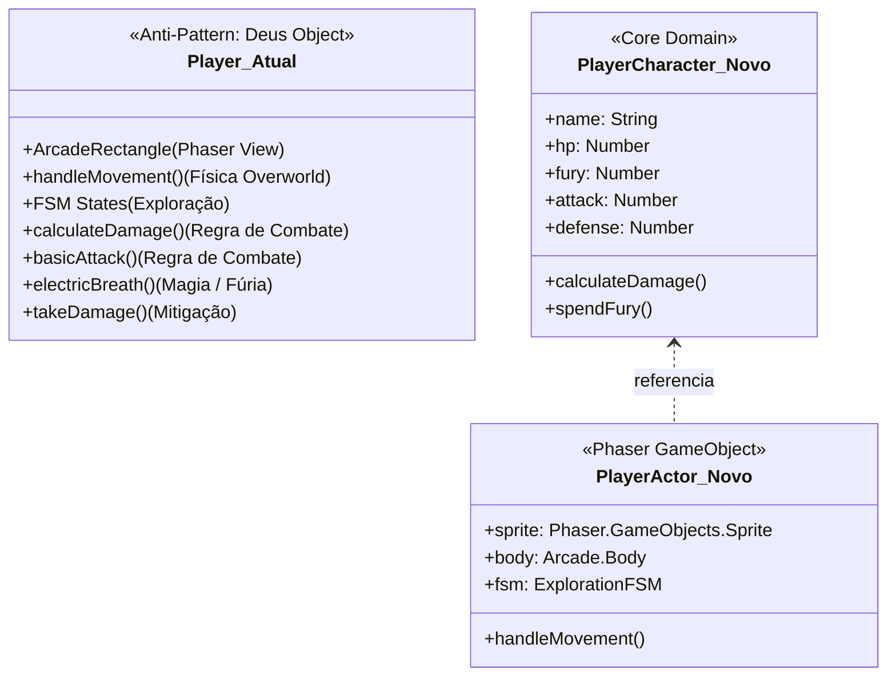

# Relatório de Auditoria Técnica Arquitetural
## Projeto: Sombras de Brentel (Protótipo / Vertical Slice)
**Papel:** Arquiteto Técnico de Software e Especialista em Engines de Jogos 2D  
**Data:** 05 de Setembro de 2026  
**Protagonista Controlado:** Rhogar Tordan (Guerreiro Draconato Meio-Sangue)  
**Escopo Analisado:** Protótipo funcional `sombras-de-brentel-prologue` e ecossistema de assets associado `RPG/rpg`.

---

## Sumário Executivo

Este documento apresenta uma auditoria técnica e arquitetural completa do protótipo funcional **Sombras de Brentel**, um JRPG 2D clássico com perspectiva superior (*top-down*), combate tático por turnos e arquitetura orientada a dados (*data-driven*). A análise foi realizada com base na inspeção estática de código-fonte, execução de testes unitários automatizados e levantamento de ativos de áudio, arte e dados.

As conclusões estão categorizadas estritamente entre **Fatos Encontrados** (evidências concretas extraídas da base de código) e **Recomendações Arquiteturais** (diretrizes para a evolução técnica do projeto).

---

## 1. Tecnologias, Versões e Dependências Utilizadas

### Fatos Encontrados

A análise dos manifestos de dependências ([package.json](file:///C:/Users/jonat/OneDrive/Documentos/07_Projetos_Dev_Python/sombras_brentel/sombras-de-brentel-prologue/package.json#L1-L25) e [vite.config.js](file:///C:/Users/jonat/OneDrive/Documentos/07_Projetos_Dev_Python/sombras_brentel/sombras-de-brentel-prologue/vite.config.js#L1-L15)) revelou a seguinte pilha tecnológica:

| Categoria | Tecnologia | Versão Declarada | Finalidade no Projeto | Arquivo de Origem |
| :--- | :--- | :--- | :--- | :--- |
| **Engine de Jogo** | Phaser | `^4.2.1` | Renderização WebGL/Canvas, física Arcade, gerenciamento de cenas e áudio | [package.json](file:///C:/Users/jonat/OneDrive/Documentos/07_Projetos_Dev_Python/sombras_brentel/sombras-de-brentel-prologue/package.json#L17) |
| **Bundler / Dev Server** | Vite | `^8.2.2` | Hot Module Replacement (HMR), empacotamento ESM para desenvolvimento e produção | [package.json](file:///C:/Users/jonat/OneDrive/Documentos/07_Projetos_Dev_Python/sombras_brentel/sombras-de-brentel-prologue/package.json#L14) |
| **Desktop Runtime** | Electron | `^44.0.0` | Execução Desktop multiplataforma com acesso a FileSystem nativo | [package.json](file:///C:/Users/jonat/OneDrive/Documentos/07_Projetos_Dev_Python/sombras_brentel/sombras-de-brentel-prologue/package.json#L12) |
| **Desktop Builder** | Electron Builder | `^26.15.3` | Empacotador de executáveis binários para Windows/Linux/macOS | [package.json](file:///C:/Users/jonat/OneDrive/Documentos/07_Projetos_Dev_Python/sombras_brentel/sombras-de-brentel-prologue/package.json#L13) |
| **Orquestrador de Tarefas** | Concurrently | `^10.0.5` | Execução paralela do servidor Vite (`npm run dev`) e do Electron | [package.json](file:///C:/Users/jonat/OneDrive/Documentos/07_Projetos_Dev_Python/sombras_brentel/sombras-de-brentel-prologue/package.json#L11) |
| **Utilitário de Boot** | Wait-on | `^9.1.0` | Sincronização de inicialização aguardando a porta `tcp:3000` estar pronta | [package.json](file:///C:/Users/jonat/OneDrive/Documentos/07_Projetos_Dev_Python/sombras_brentel/sombras-de-brentel-prologue/package.json#L15) |
| **Test Runner** | Node.js Test Runner | Nativo (`node --test`) | Execução de testes unitários isolados sem dependências externas | [package.json](file:///C:/Users/jonat/OneDrive/Documentos/07_Projetos_Dev_Python/sombras_brentel/sombras-de-brentel-prologue/package.json#L8) |
| **Módulos JS** | ECMAScript Modules | `type: "module"` | Padrão nativo de imports/exports do ES6+ em todo o projeto | [package.json](file:///C:/Users/jonat/OneDrive/Documentos/07_Projetos_Dev_Python/sombras_brentel/sombras-de-brentel-prologue/package.json#L4) |

#### Scripts de Automação Configurados:
- `npm run dev`: Inicia o servidor Vite na porta `3000`.
- `npm run build`: Compila o bundle de produção na pasta `dist/` com sourcemaps habilitados.
- `npm test`: Executa os testes unitários via `node --test` em `tests/`.
- `npm run electron:dev`: Dispara o Vite e acopla a janela Electron com recarregamento automático.
- `npm run electron:build`: Compila o bundle Vite e gera a distribuição empacotada do Electron.

### Recomendações
1. **Padronização de Versão do Phaser:** A dependência `phaser: "^4.2.1"` no `package.json` corresponde à linha de desenvolvimento mais recente / prévia da engine (Phaser 3/4). Recomenda-se fixar a versão exata no lockfile para evitar quebras de compatibilidade de API em builds futuras.
2. **Build Web Isolada:** Separar as dependências exclusivas de Desktop (`electron`, `electron-builder`, `wait-on`, `concurrently`) em um sub-pacote ou pacote desktop isolado, garantindo builds web ultra-leves para deploy no navegador.

---

## 2. Estrutura de Cenas e Fluxo Atual do Jogo

### Fatos Encontrados

O fluxo de execução do protótipo é estruturado em **15 cenas Phaser**, registradas em ordem no arquivo [src/main.js](file:///C:/Users/jonat/OneDrive/Documentos/07_Projetos_Dev_Python/sombras_brentel/sombras-de-brentel-prologue/src/main.js#L1-L32). A resolução base da aplicação está fixada em `800x600` pixels com escalonamento responsivo `Phaser.Scale.FIT` e auto-centralização `Phaser.Scale.CENTER_BOTH`.

```mermaid
graph TD
    Preload[1. PreloadScene] --> Menu[2. MenuScene]
    Menu -->|Opções| Settings[SettingsScene]
    Settings -->|Voltar| Menu
    Menu -->|Novo Jogo / Continuar| UI[UIScene (Overlay Global)]
    Menu -->|Novo Jogo| Tavern[3. TavernScene (Hub Inicial)]
    Menu -->|Continuar| CheckpointScene[Cena Salva / Checkpoint]

    Tavern -->|Joseph Sylven / Flashback| GameScene[4. GameScene (Flashback Estayler)]
    GameScene -->|Diálogo Iksar| BattleFlashback[5. BattleScene (Guardas de Estayler)]
    BattleFlashback -->|Vitória / Derrota| RewardFlashback[6. RewardScene (Espada Bastarda)]
    RewardFlashback -->|Retorno| Tavern

    Tavern -->|Porta Sul (Requer Quest 1)| City[7. RastphenCityScene (Hub Central 2400x1800)]
    City -->|Entrada Norte| Temple[8. TempleScene (Templo de Palmem)]
    Temple -->|Diálogo Sacerdotisa / Gruther| City
    City -->|Portão Sul (Requer Quest 2)| Forest[9. ForestRouteScene (Estrada da Floresta 1600x1200)]
    
    Forest -->|Celeiro / Fazenda| Forest
    Forest -->|Emboscada Goblin| BattleOverworld[BattleScene (Overlay)]
    BattleOverworld --> RewardOverworld[RewardScene (Recupera 25% HP)]
    RewardOverworld --> Forest
    Forest -->|Trilha Sul (Requer Quest 3)| Dungeon[10. DungeonScene (Masmorra 1600x1200)]

    Dungeon -->|Fogueira| DungeonSave[Salva Jogo + Cura Total]
    Dungeon -->|Inimigos Cultista / Corruptor| BattleDungeon[BattleScene (Overlay)]
    BattleDungeon --> RewardDungeon[RewardScene]
    RewardDungeon --> Dungeon
    Dungeon -->|3 Runas Purificadas + Portão Sul| DemoEnd[11. DemoEndScene (Fim do Prólogo / Wishlist)]

    Tavern -.->|Tecla ESC| Pause[PauseScene (Modal)]
    City -.->|Tecla ESC| Pause
    Temple -.->|Tecla ESC| Pause
    Forest -.->|Tecla ESC| Pause
    Dungeon -.->|Tecla ESC| Pause
    BattleFlashback -.->|Derrota Normal| GameOver[GameOverScene]
    BattleDungeon -.->|Derrota| GameOver
    GameOver -->|Tentar Novamente / Carregar| Tavern
```

#### Catálogo Completo das Cenas Analisadas:

1. [PreloadScene.js](file:///C:/Users/jonat/OneDrive/Documentos/07_Projetos_Dev_Python/sombras_brentel/sombras-de-brentel-prologue/src/scenes/PreloadScene.js): Carrega 8 manifestos JSON em `public/data/` e gera texturas procedurais provisórias via `this.make.graphics` para retratos e partículas antes de transferir para a `MenuScene`.
2. [MenuScene.js](file:///C:/Users/jonat/OneDrive/Documentos/07_Projetos_Dev_Python/sombras_brentel/sombras-de-brentel-prologue/src/scenes/MenuScene.js): Menu principal navegável por teclado e mouse (Novo Jogo, Continuar com validação de save existente via `SaveManager.hasSave()`, Opções).
3. [UIScene.js](file:///C:/Users/jonat/OneDrive/Documentos/07_Projetos_Dev_Python/sombras_brentel/sombras-de-brentel-prologue/src/scenes/UIScene.js): Overlay global persistente que opera em paralelo às cenas de exploração. Gerencia a instância única de [DialogueBox.js](file:///C:/Users/jonat/OneDrive/Documentos/07_Projetos_Dev_Python/sombras_brentel/sombras-de-brentel-prologue/src/ui/DialogueBox.js) e o HUD flutuante de objetivos narrativos.
4. [TavernScene.js](file:///C:/Users/jonat/OneDrive/Documentos/07_Projetos_Dev_Python/sombras_brentel/sombras-de-brentel-prologue/src/scenes/TavernScene.js): Hub inicial de exploração (800x600). Contém colisores estáticos de mesas e balcão, NPCs interativos (Hilda com [ShopUI.js](file:///C:/Users/jonat/OneDrive/Documentos/07_Projetos_Dev_Python/sombras_brentel/sombras-de-brentel-prologue/src/ui/ShopUI.js), Quadro de Avisos com [WorldMapUI.js](file:///C:/Users/jonat/OneDrive/Documentos/07_Projetos_Dev_Python/sombras_brentel/sombras-de-brentel-prologue/src/ui/WorldMapUI.js), Veronica Stinfy, Traudon & Alicia, John Bardem e Joseph Sylven).
5. [GameScene.js](file:///C:/Users/jonat/OneDrive/Documentos/07_Projetos_Dev_Python/sombras_brentel/sombras-de-brentel-prologue/src/scenes/GameScene.js): Cena narrativa de flashback que recria a emboscada da carroça de escravos na Avenida de Estayler com o mercenário Iksar e a acólita Ilídiz, servindo de transição para o combate inicial.
6. [BattleScene.js](file:///C:/Users/jonat/OneDrive/Documentos/07_Projetos_Dev_Python/sombras_brentel/sombras-de-brentel-prologue/src/scenes/BattleScene.js): Motor de combate tático por turnos com suporte a multi-alvo, interface por teclado, sistema de Fúria e game juice.
7. [RewardScene.js](file:///C:/Users/jonat/OneDrive/Documentos/07_Projetos_Dev_Python/sombras_brentel/sombras-de-brentel-prologue/src/scenes/RewardScene.js): Tela pós-batalha que concede a Espada Bastarda Serrilhada (+20 ATQ) no flashback ou cura 25% do HP máximo em vitórias de mapa aberto, persistindo o estado via auto-save.
8. [RastphenCityScene.js](file:///C:/Users/jonat/OneDrive/Documentos/07_Projetos_Dev_Python/sombras_brentel/sombras-de-brentel-prologue/src/scenes/RastphenCityScene.js): Grande mapa urbano (2400x1800) conectando a Taverna, o Templo de Palmem ao norte e o Portão Sul, com câmera de tracking suave e NPCs de patrulha.
9. [TempleScene.js](file:///C:/Users/jonat/OneDrive/Documentos/07_Projetos_Dev_Python/sombras_brentel/sombras-de-brentel-prologue/src/scenes/TempleScene.js): Santuário sagrado (800x600) com piso de mármore, altar cerimonial, a Sacerdotisa e o leito de Gruther febril.
10. [ForestRouteScene.js](file:///C:/Users/jonat/OneDrive/Documentos/07_Projetos_Dev_Python/sombras_brentel/sombras-de-brentel-prologue/src/scenes/ForestRouteScene.js): Estrada exterior (1600x1200) com árvores colidíveis procedurais, fazenda dos halflings, celeiro arrombado, baús de saque e emboscadas de monstros.
11. [DungeonScene.js](file:///C:/Users/jonat/OneDrive/Documentos/07_Projetos_Dev_Python/sombras_brentel/sombras-de-brentel-prologue/src/scenes/DungeonScene.js): Masmorra sombria (1600x1200) com checkpoint de fogueira, 3 pedestais de runa purificáveis e o Grande Portão Sul de acesso ao Boss.
12. [DemoEndScene.js](file:///C:/Users/jonat/OneDrive/Documentos/07_Projetos_Dev_Python/sombras_brentel/sombras-de-brentel-prologue/src/scenes/DemoEndScene.js): Tela de encerramento da demonstração com agradecimentos e botão interativo para a Lista de Desejos da Steam.
13. [PauseScene.js](file:///C:/Users/jonat/OneDrive/Documentos/07_Projetos_Dev_Python/sombras_brentel/sombras-de-brentel-prologue/src/scenes/PauseScene.js): Modal de pausa sobreposto (Overlay) que congela a cena ativa e permite retomar, abrir configurações ou sair para o menu principal.
14. [SettingsScene.js](file:///C:/Users/jonat/OneDrive/Documentos/07_Projetos_Dev_Python/sombras_brentel/sombras-de-brentel-prologue/src/scenes/SettingsScene.js): Tela de opções para ajuste incremental de volume BGM (0 a 100%), volume SFX (0 a 100%) e alternância de tela cheia (*fullscreen*).
15. [GameOverScene.js](file:///C:/Users/jonat/OneDrive/Documentos/07_Projetos_Dev_Python/sombras_brentel/sombras-de-brentel-prologue/src/scenes/GameOverScene.js): Tela de derrota que permite tentar novamente a partir da cena anterior, carregar o último savegame do disco/storage ou retornar ao menu principal.

### Recomendações
1. **Unificação de Cenas de Exploração:** Em vez de manter 5 classes de cena separadas (`TavernScene`, `RastphenCityScene`, `TempleScene`, `ForestRouteScene`, `DungeonScene`) com geometrias hardcoded em código JS, adotar uma única classe `WorldScene` genérica que recebe o identificador do mapa (`mapId`) e carrega o Tilemap Tiled correspondente em formato JSON.

---

## 3. Sistemas Implementados

```mermaid
graph LR
    subgraph "Camada de Apresentação (Phaser)"
        Scenes[Cenas do Jogo]
        UIScene[UIScene / DialogueBox]
        Shop[ShopUI / WorldMapUI]
    end

    subgraph "Entidades"
        Player[Player.js (Rhogar Tordan)]
    end

    subgraph "Serviços e Gerenciadores (Singletons)"
        Input[InputManager]
        World[WorldManager]
        Quest[QuestManager]
        Inv[InventoryManager]
        Save[SaveManager]
        Audio[AudioManager]
        FX[FXManager]
        Log[Logger]
    end

    subgraph "Persistência e Arquivos"
        IPC[Electron IPC / savegame.dat]
        LS[Web LocalStorage]
        JSON[Data JSONs: quests, maps, dialogues]
    end

    Scenes --> Player
    Scenes --> Input
    Scenes --> World
    Scenes --> FX
    UIScene --> Quest
    Scenes --> Audio
    World --> Quest
    World --> JSON
    Save --> Inv
    Save --> Quest
    Save --> IPC
    Save --> LS
    Log --> Scenes
```

### 3.1. Movimentação e FSM do Jogador
- **Implementação:** Arquivo [src/entities/Player.js](file:///C:/Users/jonat/OneDrive/Documentos/07_Projetos_Dev_Python/sombras_brentel/sombras-de-brentel-prologue/src/entities/Player.js#L1-L180).
- **Máquina de Estados Finita (FSM):** Estados `IDLE`, `WALKING`, `INTERACTING`, `TRANSITIONING`, `PAUSED`.
- **Física:** Utiliza `Phaser.Physics.Arcade` com colisão contra o mundo (`setCollideWorldBounds(true)`) e velocidade configurável (padrão de `220 px/s`, reduzida para `160 px/s` na taverna e `180 px/s` no templo e masmorra).
- **Normalização Diagonal:** O vetor de velocidade diagonal é multiplicado pelo fator `0.7071` ($\sqrt{2}/2$), impedindo que o movimento em diagonais seja mais rápido que o linear.
- **Bloqueio de Movimento:** Quando o estado é `INTERACTING`, `TRANSITIONING` ou `PAUSED`, a velocidade linear do corpo físico é forçada para `(0, 0)`.

### 3.2. Interação Espacial
- **Implementação:** Detecção de proximidade em tempo real nas cenas de exploração.
- **Mecanismo Duplo:**
  1. Cálculo de Distância Euclidiana ([TavernScene.js](file:///C:/Users/jonat/OneDrive/Documentos/07_Projetos_Dev_Python/sombras_brentel/sombras-de-brentel-prologue/src/scenes/TavernScene.js#L180-L195)): `Phaser.Math.Distance.Between(player.x, player.y, ent.x, ent.y) < 50`.
  2. Zonas de Sobreposição Física ([TempleScene.js](file:///C:/Users/jonat/OneDrive/Documentos/07_Projetos_Dev_Python/sombras_brentel/sombras-de-brentel-prologue/src/scenes/TempleScene.js#L125-L140) e [DungeonScene.js](file:///C:/Users/jonat/OneDrive/Documentos/07_Projetos_Dev_Python/sombras_brentel/sombras-de-brentel-prologue/src/scenes/DungeonScene.js#L110-L130)): Zonas estáticas `this.add.zone(...)` verificadas via `physics.overlap`.
- **Feedback Visual:** Indicador flutuante contextual (*Prompt* `[Z] Interagir`, `[Z] Descansar`, `[Z] Purificar`) que segue a posição do alvo ou do jogador.

### 3.3. Diálogos e Narrativa
- **Implementação:** [src/ui/DialogueBox.js](file:///C:/Users/jonat/OneDrive/Documentos/07_Projetos_Dev_Python/sombras_brentel/sombras-de-brentel-prologue/src/ui/DialogueBox.js#L1-L280) acoplada à [src/scenes/UIScene.js](file:///C:/Users/jonat/OneDrive/Documentos/07_Projetos_Dev_Python/sombras_brentel/sombras-de-brentel-prologue/src/scenes/UIScene.js#L1-L60).
- **Efeito Typewriter:** Escrita dinâmica de caracteres com atraso de `25ms` por letra via timer do Phaser (`time.addEvent`).
- **Retratos Dinâmicos (*Portraits*):** Suporte a retratos com efeito de slide e fade-in suave (`tweens.add` com duração de `300ms`).
- **Auto-Dimensionamento:** Ajuste dinâmico de altura (`updateBackgroundSize`) para acomodar escolhas múltiplas sem cortar textos.
- **Ramificação de Escolhas (*Choices*):** Navegação vertical por teclado (UP/DOWN/CONFIRM) com destaque visual dourado (`#ffff00`) e suporte a nós de resposta imediata (`choice.response`) ou saltos condicionais.
- **Desacoplamento Global:** Abertura e avanço disparados via barramento global de eventos (`game.events.emit('openDialogue')`, `game.events.emit('advanceDialogue')`).

### 3.4. Combate por Turnos
- **Implementação:** [src/scenes/BattleScene.js](file:///C:/Users/jonat/OneDrive/Documentos/07_Projetos_Dev_Python/sombras_brentel/sombras-de-brentel-prologue/src/scenes/BattleScene.js#L1-L420).
- **FSM de Batalha:** Estados `SELECTING_ACTION`, `SELECTING_TARGET`, `EXECUTING`, `ENEMY_TURN`.
- **Fórmula de Dano:** $Dano = \max(1, DanoBruto - DefesaAlvo) \times (1 \pm 10\%)$.
- **Sistema de Recursos de Rhogar Tordan:**
  - **HP (Pontos de Vida):** `120/120`.
  - **Fúria:** `0/100` (Recurso tático que cresce ao atacar `+10` e ao sofrer dano `+15`).
- **Ações Táticas Disponíveis:**
  - *Ataque Básico:* Causa dano físico mitigado pela DEF do alvo e gera `+10` de Fúria.
  - *Sopro Elétrico:* Consome `50` de Fúria, penetra `50%` da Defesa do alvo e causa dano ampliado em $2.5\times$.
  - *Defender:* Concede postura defensiva e gera `+15` de Fúria.
  - *Item:* Abre o modal de consumíveis em combate para usar Poções de Vida ou Cerveja Anã.
- **Game Juice e Impacto Cinético:** Orquestrado por [src/services/FXManager.js](file:///C:/Users/jonat/OneDrive/Documentos/07_Projetos_Dev_Python/sombras_brentel/sombras-de-brentel-prologue/src/services/FXManager.js#L1-L150):
  - *Hit-Stop:* Micro-pausa de congelamento de tweens de `80ms` a `90ms` ao atingir um golpe.
  - *Screen Shake Escalonado:* Calibrado por faixas de dano (<20 leve: 80ms/0.005; 20-50 médio: 120ms/0.012; >=50 crítico: 200ms/0.025).
  - *Partículas:* Emissores de faíscas cortantes e descargas elétricas procedurais.
  - *Floating Combat Text:* Texto numérico de dano subindo e sumindo suavemente.

### 3.5. Inventário e Economia
- **Implementação:** [src/services/InventoryManager.js](file:///C:/Users/jonat/OneDrive/Documentos/07_Projetos_Dev_Python/sombras_brentel/sombras-de-brentel-prologue/src/services/InventoryManager.js#L1-L70).
- **Estrutura:** Singleton gerenciador de moedas de ouro (`gold: 50` inicial) e pilha vetorial de itens consumíveis:
  - `potion_heal`: Poção de Vida (+50 HP, valor 20 PO).
  - `dwarven_ale`: Cerveja Anã (+30 Fúria, valor 15 PO).
- **Interface de Loja:** [src/ui/ShopUI.js](file:///C:/Users/jonat/OneDrive/Documentos/07_Projetos_Dev_Python/sombras_brentel/sombras-de-brentel-prologue/src/ui/ShopUI.js#L1-L120) com suporte a teclado e validação de saldo.

### 3.6. Missões (Quests)
- **Implementação:** [src/services/QuestManager.js](file:///C:/Users/jonat/OneDrive/Documentos/07_Projetos_Dev_Python/sombras_brentel/sombras-de-brentel-prologue/src/services/QuestManager.js#L1-L100).
- **Barramento Agnóstico:** Herda de `BaseEventEmitter` puro, operando no browser ou em Node.js sem acoplamento a DOM ou Phaser.
- **Campanha da Demo (5 Missões Encadeadas em [quests.json](file:///C:/Users/jonat/OneDrive/Documentos/07_Projetos_Dev_Python/sombras_brentel/sombras-de-brentel-prologue/public/data/quests.json#L1-L32)):**
  1. `quest_01_flashback`: "Memórias de Estayler" (Falar com clientes da taverna e Joseph Sylven).
  2. `quest_02_temple`: "O Templo de Palmem" (Visitar Gruther no templo de Rastphen).
  3. `quest_03_investigate_farm`: "Rastros na Névoa" (Investigar o celeiro arrombado na fazenda dos halflings).
  4. `quest_04_forest_trail`: "A Trilha do Bosque Cinzento" (Seguir os rastros até as ruínas da masmorra).
  5. `quest_05_defeat_minotaur`: "O Pesadelo Abissal" (Derrotar a aberração abissal).

### 3.7. Salvamento e Persistência
- **Implementação:** [src/services/SaveManager.js](file:///C:/Users/jonat/OneDrive/Documentos/07_Projetos_Dev_Python/sombras_brentel/sombras-de-brentel-prologue/src/services/SaveManager.js#L1-L160).
- **Arquitetura de Triplo Fallback Resiliente:**
  1. *Camada 1 (Electron IPC Nativo):* Gravação síncrona no arquivo `savegame.dat` no disco local.
  2. *Camada 2 (Web LocalStorage):* Armazenamento na chave `sombras_brentel_save` do navegador.
  3. *Camada 3 (In-Memory Fallback):* Armazenamento em memória RAM (`_memoryStore`) para suites de teste Node.js.
- **Codificação:** Serialização JSON compactada em Base64 com codificação/decodificação resiliente a caracteres UTF-8 e acentuação da língua portuguesa.
- **Payload Unificado:** Persiste dados vitais do jogador (HP, ATK, DEF, Fúria, Arma equipada, Cena e Coordenadas de Checkpoint), inventário e dicionário de missões.

### 3.8. Áudio
- **Implementação:** [src/audio/AudioManager.js](file:///C:/Users/jonat/OneDrive/Documentos/07_Projetos_Dev_Python/sombras_brentel/sombras-de-brentel-prologue/src/audio/AudioManager.js#L1-L90).
- **Funcionalidades:** Orquestração de BGM (música de fundo em loop) com suporte a crossfade via tweens e disparo de efeitos sonoros pontuais (SFX) com controle de volume independente.

### 3.9. Transições e Portais
- **Implementação:** [src/services/WorldManager.js](file:///C:/Users/jonat/OneDrive/Documentos/07_Projetos_Dev_Python/sombras_brentel/sombras-de-brentel-prologue/src/services/WorldManager.js#L1-L120) orientado a dados via [map_transitions.json](file:///C:/Users/jonat/OneDrive/Documentos/07_Projetos_Dev_Python/sombras_brentel/sombras-de-brentel-prologue/public/data/map_transitions.json#L1-L50).
- **Segurança de Spawn:** Bloqueio atômico `isTransitioning` e coordenadas de spawn seguras para prevenir loops infinitos de colisão entre portas.
- **Bloqueio Condicional:** Se a transição exigir uma quest não concluída (`requiredQuest`), o jogador é repelido fisicamente e um balão de pensamento ([thought_interactions.json](file:///C:/Users/jonat/OneDrive/Documentos/07_Projetos_Dev_Python/sombras_brentel/sombras-de-brentel-prologue/public/data/thought_interactions.json#L1-L20)) é exibido na UI global.

### 3.10. Controles e Entradas
- **Implementação:** [src/services/InputManager.js](file:///C:/Users/jonat/OneDrive/Documentos/07_Projetos_Dev_Python/sombras_brentel/sombras-de-brentel-prologue/src/services/InputManager.js#L1-L140).
- **Mapeamento:**
  - Direcionais: Setas do teclado e teclas WASD.
  - Confirmação: `ESPAÇO`, `ENTER`, `Z` (ou Botão A do Gamepad).
  - Cancelamento / Voltar: `X`, `ESC` (ou Botão B do Gamepad).
  - Menu / Pausa: `ESC`.
- **Prevenção de Vazamento de Memória (*Memory Leaks*):** Método `cleanListeners()` invocado automaticamente nos eventos de ciclo de vida `SHUTDOWN` e `DESTROY` de cada cena.
- **Atalhos de Desenvolvedor ([DevShortcuts.js](file:///C:/Users/jonat/OneDrive/Documentos/07_Projetos_Dev_Python/sombras_brentel/sombras-de-brentel-prologue/src/utils/DevShortcuts.js#L1-L60)):** `F1` (Hitboxes Debug), `F2` (Completar Quests), `1` a `5` (Teletransporte para as cenas principais).

### 3.11. Testes Automatizados
- **Implementação:** [tests/](file:///C:/Users/jonat/OneDrive/Documentos/07_Projetos_Dev_Python/sombras_brentel/sombras-de-brentel-prologue/tests/) executados nativamente via `node --test`.
- **Cobertura Atual:** 12 testes unitários (100% de aprovação em ~186ms):
  - [InventoryManager.test.js](file:///C:/Users/jonat/OneDrive/Documentos/07_Projetos_Dev_Python/sombras_brentel/sombras-de-brentel-prologue/tests/InventoryManager.test.js): 5 testes (adição/remoção, cap de cura e fúria, persistência de ouro).
  - [QuestManager.test.js](file:///C:/Users/jonat/OneDrive/Documentos/07_Projetos_Dev_Python/sombras_brentel/sombras-de-brentel-prologue/tests/QuestManager.test.js): 4 testes (inicialização, disparo de eventos `questUpdated`, progressão linear, reset).
  - [SaveManager.test.js](file:///C:/Users/jonat/OneDrive/Documentos/07_Projetos_Dev_Python/sombras_brentel/sombras-de-brentel-prologue/tests/SaveManager.test.js): 3 testes (salvamento/recuperação com acentuação UTF-8, payload default, limpeza com `clearSave`).

---

## 4. Componentes Reutilizáveis com Segurança em um Projeto Novo

Os seguintes componentes apresentam excelente grau de maturidade, coesão de responsabilidade e baixo acoplamento, estando prontos para reutilização direta na nova versão:

1. **[QuestManager.js](file:///C:/Users/jonat/OneDrive/Documentos/07_Projetos_Dev_Python/sombras_brentel/sombras-de-brentel-prologue/src/services/QuestManager.js):** Motor de eventos independente de DOM e engine gráfica.
2. **[SaveManager.js](file:///C:/Users/jonat/OneDrive/Documentos/07_Projetos_Dev_Python/sombras_brentel/sombras-de-brentel-prologue/src/services/SaveManager.js):** Persistência robusta com triplo fallback (IPC/LocalStorage/Memory) e suporte total a UTF-8.
3. **[InventoryManager.js](file:///C:/Users/jonat/OneDrive/Documentos/07_Projetos_Dev_Python/sombras_brentel/sombras-de-brentel-prologue/src/services/InventoryManager.js):** Lógica pura de catálogo e acúmulo de consumíveis e ouro.
4. **[Logger.js](file:///C:/Users/jonat/OneDrive/Documentos/07_Projetos_Dev_Python/sombras_brentel/sombras-de-brentel-prologue/src/utils/Logger.js):** Sistema de log contextualizado com captura global de `unhandledrejection` e `window.onerror`.
5. **[InputManager.js](file:///C:/Users/jonat/OneDrive/Documentos/07_Projetos_Dev_Python/sombras_brentel/sombras-de-brentel-prologue/src/services/InputManager.js):** Abstração de comandos lógicos (`CONFIRM`, `CANCEL`, `MENU`) com limpeza rigorosa de listeners.
6. **[FXManager.js](file:///C:/Users/jonat/OneDrive/Documentos/07_Projetos_Dev_Python/sombras_brentel/sombras-de-brentel-prologue/src/services/FXManager.js):** Módulo de feedback cinético (Hit-Stop, Screen Shake escalonado e números flutuantes).
7. **Bases Orientadas a Dados ([public/data/*.json](file:///C:/Users/jonat/OneDrive/Documentos/07_Projetos_Dev_Python/sombras_brentel/sombras-de-brentel-prologue/public/data/)):** Todos os manifestos JSON de diálogos, interações morais, transições de mapa e missões.
8. **Suíte de Testes ([tests/*.test.js](file:///C:/Users/jonat/OneDrive/Documentos/07_Projetos_Dev_Python/sombras_brentel/sombras-de-brentel-prologue/tests/)):** Testes unitários com tempo de execução ultrarrápido sem ferramentas pesadas.

---

## 5. Componentes Excessivamente Acoplados ou que Devem Ser Reescritos

### Diagnóstico de Acoplamento



1. **[src/entities/Player.js](file:///C:/Users/jonat/OneDrive/Documentos/07_Projetos_Dev_Python/sombras_brentel/sombras-de-brentel-prologue/src/entities/Player.js):**
   - *Problema:* A classe herda diretamente de `Phaser.GameObjects.Rectangle` e acumula simultaneamente: física de movimentação do overworld, FSM de exploração, regras matemáticas de combate, lógica de cálculo de dano e a habilidade de Sopro Elétrico.
   - *Solução:* Separar em duas classes:
     - `PlayerCharacter` (Classe pura no Core Domain contendo stats, inventário e regras de combate).
     - `PlayerActor` (GameObject Phaser responsável apenas por física, sprite animado e inputs no mapa).
2. **Cenas de Exploração com Geometria Hardcoded:**
   - *Problema:* `TavernScene`, `TempleScene`, `ForestRouteScene`, `DungeonScene` e `RastphenCityScene` constroem paredes e mobílias instanciando retângulos e círculos primitivos manualmente via código em pixels absolutos.
   - *Solução:* Substituir por uma única cena `WorldScene` baseada no carregamento de arquivos Tilemap (`.tmj` / `.json` exportados do Tiled).
3. **[src/scenes/BattleScene.js](file:///C:/Users/jonat/OneDrive/Documentos/07_Projetos_Dev_Python/sombras_brentel/sombras-de-brentel-prologue/src/scenes/BattleScene.js):**
   - *Problema:* Concentra mais de 400 linhas misturando UI de botões, lógica de turnos, IA de monstros e animações de dano.
   - *Solução:* Desacoplar a lógica em um `TurnBattleEngine` (puro) e manter a `BattleScene` focada exclusivamente na orquestração visual e sonora.
4. **[src/ui/ShopUI.js](file:///C:/Users/jonat/OneDrive/Documentos/07_Projetos_Dev_Python/sombras_brentel/sombras-de-brentel-prologue/src/ui/ShopUI.js):**
   - *Problema:* O estoque (`this.stock`) está gravado de forma estática no próprio arquivo.
   - *Solução:* Injetar o catálogo de itens dinamicamente a partir dos dados do NPC mercador.

---

## 6. Bugs, Riscos Técnicos e Dívidas Encontradas

### Fatos Encontrados
1. **Dívida de Renderização Visual (Placeholders Procedurais):**
   - Na [PreloadScene.js](file:///C:/Users/jonat/OneDrive/Documentos/07_Projetos_Dev_Python/sombras_brentel/sombras-de-brentel-prologue/src/scenes/PreloadScene.js#L20-L40), retratos de personagens e partículas são gerados via primitivas vetoriais (`graphics.fillRect`), resultando em retângulos monocromáticos provisórios, enquanto o projeto possui assets reais de pixel art disponíveis.
2. **Chamada Insegura de Módulo Electron no Navegador:**
   - Em [DemoEndScene.js](file:///C:/Users/jonat/OneDrive/Documentos/07_Projetos_Dev_Python/sombras_brentel/sombras-de-brentel-prologue/src/scenes/DemoEndScene.js#L19), o código invoca `window.require('electron')` dentro de um bloco try/catch. Em ambientes web modernos empacotados pelo Vite, chamadas a `require` geram alertas ou erros em tempo de execução se não forem tratadas via `window.electronAPI`.
3. **Ausência de Reset Completo em Singletons:**
   - Ao clicar em "Novo Jogo" na [MenuScene.js](file:///C:/Users/jonat/OneDrive/Documentos/07_Projetos_Dev_Python/sombras_brentel/sombras-de-brentel-prologue/src/scenes/MenuScene.js#L68), o `QuestManager.resetQuests()` é invocado, mas o `InventoryManager` não possui uma chamada de `reset()` equivalente, podendo manter ouro e itens de uma sessão anterior na memória RAM.
4. **Incompatibilidade de Caminhos de Spawn em Resolução Fixa:**
   - Alguns pontos de spawn definidos em [map_transitions.json](file:///C:/Users/jonat/OneDrive/Documentos/07_Projetos_Dev_Python/sombras_brentel/sombras-de-brentel-prologue/public/data/map_transitions.json) utilizam coordenadas baseadas em dimensões absolutas de mapa (ex: `y: 1750` em Rastphen), exigindo atenção rigorosa ao tamanho da câmera para evitar que o jogador nasça fora dos limites visíveis.

---

## 7. Compatibilidade com Navegador, Vercel e Execução Local

### Análise de Compatibilidade

```
+-------------------------------------------------------------------------+
|                           ECOSSISTEMA DE BUILD                          |
+-------------------------------------------------------------------------+
                                     |
                 +-------------------+-------------------+
                 |                                       |
                 v                                       v
      [Deploy Web (Vercel / SPA)]             [Execução Desktop (Local)]
      - Bundler: Vite (ESM)                   - Runtime: Electron 44
      - Persistência: LocalStorage            - Persistência: savegame.dat (IPC)
      - Logs: Console Web                     - Logs: logs/YYYY-MM-DD.log
      - Rewrites: vercel.json                 - Window: Frameless / Aspect 4:3
```

#### 1. Navegador Web & Vercel
- **Status:** **100% Compatível**.
- **Mecanismos de Suporte:**
  - O `SaveManager.js` detecta a ausência de `window.electronAPI` e comuta imediatamente para o `localStorage`.
  - O `Logger.js` faz fallback transparente para os métodos nativos `console.info`, `console.warn` e `console.error`.
  - O `vite.config.js` possui `base: './'` e `outDir: 'dist'`, gerando bundles estáticos prontos para hospedagem em CDNs como Vercel, Netlify ou GitHub Pages.
- **Configuração para Vercel (`vercel.json`):**
  ```json
  {
    "rewrites": [{ "source": "/(.*)", "destination": "/index.html" }],
    "headers": [
      {
        "source": "/assets/(.*)",
        "headers": [{ "key": "Cache-Control", "value": "public, max-age=31536000, immutable" }]
      }
    ]
  }
  ```

#### 2. Execução Local Desktop (Electron)
- **Status:** **100% Compatível**.
- **Mecanismos de Suporte:**
  - Arquivo [electron/main.js](file:///C:/Users/jonat/OneDrive/Documentos/07_Projetos_Dev_Python/sombras_brentel/sombras-de-brentel-prologue/electron/main.js) com proporção de tela `4:3` (1024x768), sem menu nativo e com DevTools integrado em ambiente de desenvolvimento.
  - Bridge segura através de [electron/preload.cjs](file:///C:/Users/jonat/OneDrive/Documentos/07_Projetos_Dev_Python/sombras_brentel/sombras-de-brentel-prologue/electron/preload.cjs) expondo a API `window.electronAPI` (`saveGame`, `loadGame`, `hasSave`, `writeLog`) com isolamento de contexto (`contextIsolation: true`) e `nodeIntegration: false`.

---

## 8. Arquivos de Arte, Áudio e Dados que Podem Ser Reaproveitados

Foi realizado um inventário detalhado de todos os arquivos de mídia encontrados no projeto `RPG/rpg` e nos dados do `sombras-de-brentel-prologue`.

### Catálogo de Ativos Disponíveis para a Nova Versão:

| Tipo | Arquivo / Caminho de Origem | Formato / Tamanho | Potencial de Reaproveitamento |
| :--- | :--- | :--- | :--- |
| **Áudio BGM** | `RPG/rpg/public/assets/audio/bgm/battle_bgm.mp3` | MP3 (~7.18 MB) | Trilha sonora principal da cena de combate |
| **Áudio BGM** | `RPG/rpg/public/assets/audio/bgm/boss_bgm.mp3` | MP3 (~6.74 MB) | Trilha para confrontos especiais e chefes |
| **Áudio BGM** | `RPG/rpg/public/assets/audio/bgm/overworld_bgm.mp3` | MP3 (~6.67 MB) | Trilha de exploração de Rastphen e floresta |
| **Áudio BGM** | `RPG/rpg/public/assets/audio/bgm/title_bgm.mp3` | MP3 (~5.90 MB) | Trilha do Menu Principal |
| **Áudio BGM** | `RPG/rpg/public/assets/audio/bgm/victory_fanfare.mp3` | MP3 (~5.79 MB) | Fanfarra da tela de vitória (`RewardScene`) |
| **Áudio SFX** | `RPG/rpg/public/assets/audio/sfx/arrow_shot.mp3` | MP3 (~49 KB) | Som de projétil / ataque rápido |
| **Áudio SFX** | `RPG/rpg/public/assets/audio/sfx/hit_impact.mp3` | MP3 (~25 KB) | Som de impacto e acerto crítico |
| **Áudio SFX** | `RPG/rpg/public/assets/audio/sfx/menu_move.mp3` | MP3 (~25 KB) | Som de navegação no cursor do menu |
| **Áudio SFX** | `RPG/rpg/public/assets/audio/sfx/menu_select.mp3` | MP3 (~25 KB) | Som de confirmação de opção |
| **Áudio SFX** | `RPG/rpg/public/assets/audio/sfx/potion_use.mp3` | MP3 (~25 KB) | Som de consumo de poções |
| **Backgrounds** | `RPG/rpg/public/assets/backgrounds/battle_bg.png` | PNG (~4.78 MB) | Cenário de fundo para a `BattleScene` |
| **Backgrounds** | `RPG/rpg/public/assets/backgrounds/forest_tileset.png` | PNG (~4.92 MB) | Texturas de vegetação e terreno florestal |
| **Backgrounds** | `RPG/rpg/public/assets/backgrounds/overworld_map.png` | PNG (~1.26 MB) | Mapa ilustrado para a interface de navegação |
| **Tilesets** | `RPG/rpg/public/assets/Tiles/tile_0000.png` até `tile_0131.png` | 132 PNGs | Conjunto completo de tiles modulares para Tiled |
| **Tilemap Atlas** | `RPG/rpg/public/assets/Tilemap/tilemap_packed.png` | PNG (~5.3 KB) | Atlas empacotado para renderização de mapas |
| **Sprites** | `RPG/rpg/public/assets/sprites/goblin.png` | PNG (~1.65 MB) | Sprite de combate de monstro emboscador |
| **Sprites** | `RPG/rpg/public/assets/sprites/john_bardem.png` | PNG (~868 KB) | Sprite de NPC patrulheiro na taverna |
| **Vídeos** | `RPG/rpg/public/assets/videos/intro_1.mp4` a `intro_3.mp4` | MP4 (~7.0 MB) | Cutscenes de introdução narrativa |
| **Bases de Dados** | `sombras-de-brentel-prologue/public/data/*.json` | 8 JSONs | Todos os diálogos, missões e encontros |

---

## 9. Proposta de Arquitetura para a Nova Versão

A nova versão deve consolidar os pontos fortes comprovados pelo protótipo e eliminar completamente as dívidas de acoplamento identificadas. Propõe-se uma **Arquitetura em Camadas Desacopladas (Clean Game Architecture)**:

```
+-------------------------------------------------------------------------+
|                  CAMADA 1: CORE DOMAIN (TypeScript / ESM)               |
|  - Entidades Puras: PlayerCharacter, Enemy, Combatant                   |
|  - Regras: DamageCalculator, FurySystem, StatProgression               |
|  - Mecânicas: TurnBattleEngine, InventoryModel, QuestGraph             |
|  * Totalmente desacoplada do Phaser (100% testável via node:test)       |
+-------------------------------------------------------------------------+
                                     |
+-------------------------------------------------------------------------+
|                  CAMADA 2: APPLICATION & SERVICES                       |
|  - SaveService (Drivers: LocalStorage, IndexedDB, Electron FS)          |
|  - InputService (Mapeamento de Ações: Teclado + Gamepad + Touch)        |
|  - AudioService (BGM crossfade, SFX pools)                             |
|  - DialogueService (Parser e validador de escolhas JSON)               |
|  - EventBus (Barramento global tipado de eventos do jogo)               |
+-------------------------------------------------------------------------+
                                     |
+-------------------------------------------------------------------------+
|                  CAMADA 3: APRESENTAÇÃO (Phaser 3 / 4)                  |
|  - Scenes: BootScene, PreloadScene, TitleScene, WorldScene, BattleScene |
|  - Overlays: UIScene (DialogueBox, QuestHUD, FloatingTexts)             |
|  - GameObjects: PlayerActor (Sprite animado + Arcade Physics)           |
|  - Renderers: TiledMapRenderer (Camadas de Chão, Paredes e Objetos)     |
|  - FX: FXManager (Hit-Stop, Screen Shake, Partículas de Sprite)         |
+-------------------------------------------------------------------------+
                                     |
+-------------------------------------------------------------------------+
|                  CAMADA 4: DATA-DRIVEN INFRASTRUCTURE                   |
|  - JSON Schemas: quests.json, maps.json, dialogues.json, items.json     |
|  - Tiled Tilemaps: tavern.tmj, rastphen.tmj, temple.tmj, forest.tmj     |
+-------------------------------------------------------------------------+
```

### Princípios Norteadores da Nova Versão:
1. **Foco Estrito em Rhogar Tordan:** A entidade do jogador mantém todos os atributos canônicos (HP base 120, Ataque 18, Defesa 8, Fúria máxima 100, Sopro Elétrico com penetração de 50% de defesa).
2. **Separação Rígida entre Lógica e Apresentação:** A classe `PlayerCharacter` nunca deve importar o Phaser; ela é uma estrutura de dados de domínio instanciada e manipulada pelo `PlayerActor`.
3. **Exploração Baseada em Mapas Tiled:** Eliminação de todas as coordenadas hardcoded de paredes e NPCs em código JS, delegando o posicionamento para a camada de objetos dos arquivos `.tmj`.
4. **Combate Tático por Turnos com Feedback Premium:** Integração imediata dos assets reais de áudio (BGM de combate e SFX de corte) com o pipeline cinético do `FXManager` (Hit-Stop e Screen Shake).

---

## 10. Plano de Migração Dividido em Pequenas Etapas Verificáveis

O plano de migração foi estruturado em **9 etapas sequenciais e auto-contidas**, permitindo validação contínua e garantia de que nenhuma regressão ocorra:

```mermaid
gantt
    title Cronograma do Plano de Migração
    dateFormat  X
    axisFormat %d
    section Fundação
    Etapa 1: Setup do Workspace & Tooling          :active, 0, 1
    Etapa 2: Migração dos Serviços Core e Testes   :1, 2
    Etapa 3: Integração de Assets de Áudio e Arte  :2, 3
    section Core RPG
    Etapa 4: Refatoração da Entidade Player        :3, 4
    Etapa 5: Motor de Exploração e Tiled Maps      :4, 5
    Etapa 6: UI Global e Caixa de Diálogos         :5, 6
    section Batalha & Campanha
    Etapa 7: Motor de Combate e BattleScene        :6, 7
    Etapa 8: Validação do Fluxo da Campanha        :7, 8
    Etapa 9: Builds Multiplataforma (Web/Desktop)  :8, 9
```



### Detalhamento das Etapas de Migração:

#### Etapa 1: Setup do Workspace e Tooling Base
- **Ações:** Inicializar a estrutura limpa de diretórios do repositório `sombras-de-brentel-resgate-de-rebekka`, configurando `package.json`, `vite.config.js` e script de testes `node --test`.
- **Critério de Aceitação:** Comando `npm run dev` e `npm test` executando sem erros.

#### Etapa 2: Migração dos Serviços Core e Testes Unitários
- **Ações:** Migrar os arquivos `SaveManager.js`, `QuestManager.js`, `InventoryManager.js`, `Logger.js` e `InputManager.js`. Adicionar métodos de reset de sessão. Migrar a pasta `tests/`.
- **Critério de Aceitação:** Todos os 12 testes unitários passando com 100% de sucesso.

#### Etapa 3: Integração dos Assets Reais de Áudio e Arte
- **Ações:** Copiar e organizar os ativos de `RPG/rpg/public/assets` para `public/assets/` (áudios BGM/SFX, backgrounds, sprites e tilesets). Criar o manifesto unificado `src/config/assets.js`.
- **Critério de Aceitação:** `PreloadScene` carregando todos os arquivos MP3 e PNG sem recorrer a texturas provisórias via Graphics.

#### Etapa 4: Refatoração da Entidade Player (Rhogar Tordan)
- **Ações:** Separar `PlayerCharacter` (domínio puro) de `PlayerActor` (GameObject Phaser). Implementar FSM de exploração e normalização vetorial de movimento.
- **Critério de Aceitação:** Testes unitários validando cálculos de mitigação de dano e geração de fúria isoladamente.

#### Etapa 5: Motor Unificado de Exploração com Tilemaps (Tiled)
- **Ações:** Desenvolver a classe `WorldScene.js` capaz de instanciar mapas Tiled, carregar camadas de colisão automáticas e acoplar os gatilhos data-driven via `WorldManager.js`.
- **Critério de Aceitação:** Rhogar navegando e colidindo corretamente com as paredes da Taverna e de Rastphen.

#### Etapa 6: UI Global, HUD de Missões e Caixa de Diálogos
- **Ações:** Integrar `UIScene.js` e `DialogueBox.js` com suporte a retratos reais, typewriter e escolhas ramificadas com teclado.
- **Critério de Aceitação:** Interação com Joseph Sylven e NPCs da taverna avançando o HUD de objetivos dinamicamente.

#### Etapa 7: Refatoração do Motor de Combate por Turnos
- **Ações:** Conectar a `BattleScene.js` aos assets reais (background de batalha, sprites, BGM e SFX). Implementar a FSM de teclado, seleção de múltiplos alvos e o pipeline de impacto do `FXManager`.
- **Critério de Aceitação:** Batalha completa executável com ataque básico, sopro elétrico com penetração de defesa e uso de itens.

#### Etapa 8: Integração e Validação do Fluxo Linear da Campanha
- **Ações:** Testar a progressão completa das 5 missões (Taverna $\rightarrow$ Flashback $\rightarrow$ Cidade de Rastphen $\rightarrow$ Templo de Palmem $\rightarrow$ Estrada Sul / Celeiro $\rightarrow$ Masmorra $\rightarrow$ Portão Sul / DemoEnd).
- **Critério de Aceitação:** Partida jogável de ponta a ponta sem travamentos de câmera, erros de transição ou falhas de savegame.

#### Etapa 9: Homologação Multiplataforma (Web / Vercel / Electron)
- **Ações:** Validar o build de produção web (`npm run build`), criar o arquivo `vercel.json` com regras de reescrita SPA e testar a inicialização do empacotamento Electron local.
- **Critério de Aceitação:** Jogo perfeitamente funcional tanto no navegador (com LocalStorage) quanto no executável desktop (com `savegame.dat`).

---

## 11. Conclusão da Auditoria

O protótipo de **Sombras de Brentel** possui uma base técnica muito bem concebida no que tange a serviços de persistência, controle de missões, arquitetura data-driven e game juice. Os principais desafios para a evolução do projeto concentram-se no desacoplamento da entidade do jogador, na transição de geometrias hardcoded para mapas Tiled e na substituição dos placeholders gráficos pelos assets reais já existentes.

Com a execução do plano de migração estruturado neste relatório, o projeto estará plenamente pronto para consolidar uma experiência JRPG 2D de altíssimo nível, fluida e escalável.
